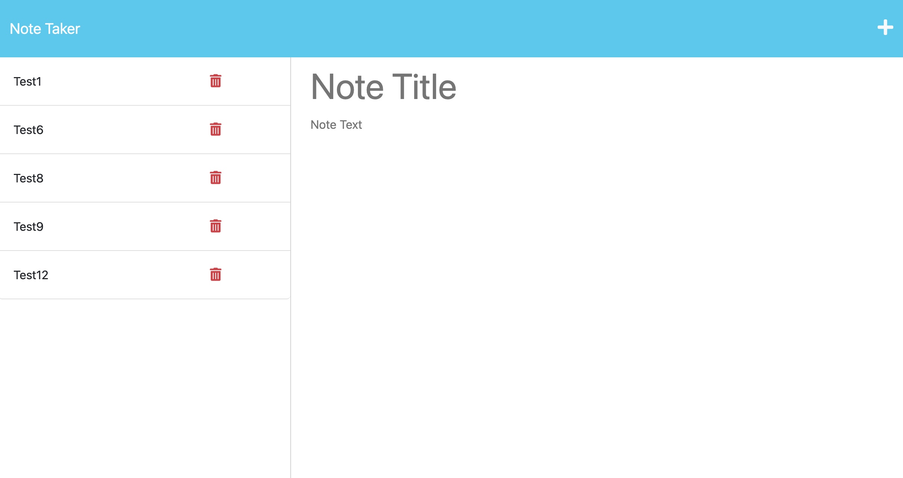

# 11 Express.js: Note Taker

# Description

Using this app, you can simply enter your notes with title and text. Your notes can be saved permanently and can be also deleted upon your demand. This is a good app as note-taker. Enjoy using this app!


## User Story


```
AS A small business owner
I WANT to be able to write and save notes
SO THAT I can organize my thoughts and keep track of tasks I need to complete
```


## Acceptance Criteria

```
GIVEN a note-taking application
WHEN I open the Note Taker
THEN I am presented with a landing page with a link to a notes page
WHEN I click on the link to the notes page
THEN I am presented with a page with existing notes listed in the left-hand column, plus empty fields to enter a new note title and the note’s text in the right-hand column
WHEN I enter a new note title and the note’s text
THEN a Save icon appears in the navigation at the top of the page
WHEN I click on the Save icon
THEN the new note I have entered is saved and appears in the left-hand column with the other existing notes
WHEN I click on an existing note in the list in the left-hand column
THEN that note appears in the right-hand column
WHEN I click on the Write icon in the navigation at the top of the page
THEN I am presented with empty fields to enter a new note title and the note’s text in the right-hand column
```


## Installation

N/A

## Usage

By using this webpage, you can easily add your notes to the app and save it. It can be deleted at anytime.

## screenshot of the page

attached. 
 
"Note Taker")

## URL of Github Repository
Repo URL: https://najiba-haidari.github.io/note-taker/ 
Github URL: https://github.com/Najiba-Haidari/note-taker 
Heroku URL: https://young-wildwood-70886.herokuapp.com/ 

## Credits

N/A

## License

Please refer to the LICENSE in the repo.